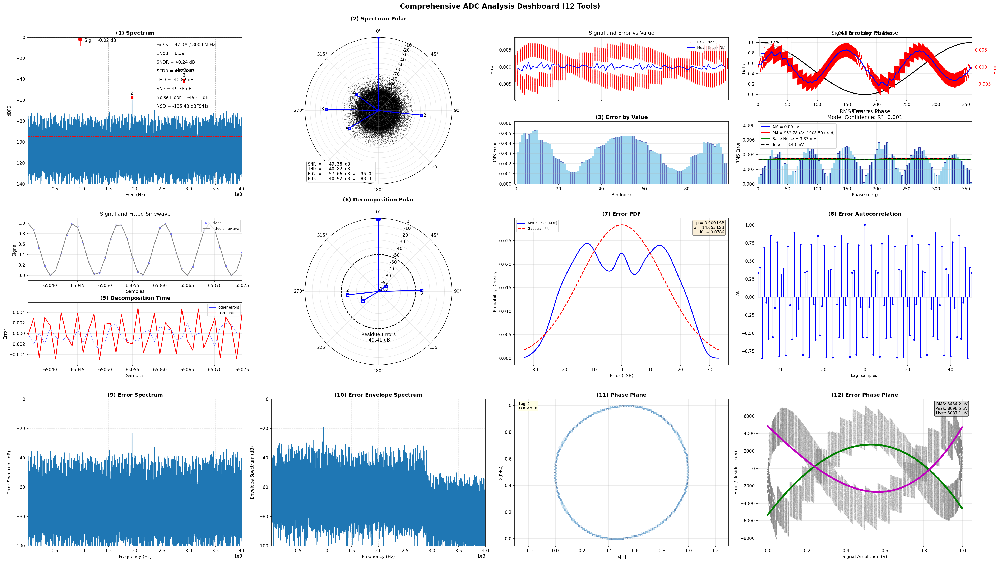

# ADCToolbox

[](https://github.com/Arcadia-1/ADCToolbox/actions/workflows/ci.yml)
[](https://arcadia-1.github.io/ADCToolbox/)
[](https://badge.fury.io/py/adctoolbox)
[](https://pypi.org/project/adctoolbox/)
[](https://www.python.org/downloads/)
[](https://opensource.org/licenses/MIT)
[](https://github.com/Arcadia-1/ADCToolbox/stargazers)


> **A Comprehensive Toolbox for ADC Characterization, Calibration, and Visualization.**
>
> *Unlocking ADC Insights through Multi-Dimensional Analysis.*

## Features

- **Comprehensive Spectrum Analysis**
  - **Full Metric Suite**: Extraction of ENOB, SNDR, SNR, SFDR, THD, NSD, and Noise Floor.
  - **Smart labeling**: Automated labeling for harmonics, noise floor, and OSR bandwidth.
  - **Polar Spectrum**: Visualizes phase errors to distinguish static from dynamic nonlinearities.
  - **Validated Signal Processing**: Eight window functions; two averaging modes (power spectrum averaging & complex/coherent spectrum averaging)

- **Advanced Error Visualization**
  - goes beyond standard plots with **Polar Spectrum Analysis** to visualize 
  - phase/magnitude relationships and **Error Envelope** plots to identify dynamic nonlinearities.
  - decomposes ADC errors into time-domain (INL/DNL), frequency-domain (Harmonics/Spurs), and statistical components (PDF/Histograms) for root-cause analysis.

- **Realistic Signal Modeling**: generates high-fidelity ADC waveforms simulating real-world impairments, including clock jitter, thermal noise, quantization effects, settling errors, and noise-shaped quantization.

- **Calibration Algorithms**: built-in reference implementations for digital calibration, including bit-weight extraction and redundancy management for SAR and Pipeline architectures.

- **Oversampling Workflows**: MATLAB-compatible `ifilter`, `perfosr`, and
  `ntfperf` entry points for in-band extraction, performance-vs-OSR sweeps,
  and NTF analysis.

<div align="center">
  
</div>


## Installation

```bash
# Install
pip install adctoolbox

# Upgrade if already installed
pip install --upgrade adctoolbox

# Check version
python -c "import adctoolbox; print(adctoolbox.__version__)"
```

## Quick Start

**Get all 63 runnable examples in one command:**

```bash
cd /path/to/your/workspace
adctoolbox-get-examples
```

This creates an `adctoolbox_examples/` directory with all examples organized by category.

**Run an example:**

```bash
cd adctoolbox_examples/02_spectrum
python exp_s01_analyze_spectrum_simplest.py
```

**Use in your code:**

```python
from adctoolbox import analyze_spectrum

# Analyze signal spectrum
result = analyze_spectrum(signal, fs=800e6, create_plot=True)
print(f"ENOB: {result['enob']:.2f} bits, SNDR: {result['sndr_dbc']:.2f} dB")
```

See [Usage Examples](#usage-examples) section below for detailed code examples.

## Example Categories

| Folder | Count | Focus |
|--------|------:|-------|
| `01_basic/` | 2 | Environment checks and coherent sampling basics |
| `02_spectrum/` | 14 | FFT analysis, windows, averaging, polar plots, and near-Nyquist handling |
| `03_generate_signals/` | 6 | Synthetic ADC signals with noise, jitter, quantization, nonlinearities, and interference |
| `04_debug_analog/` | 15 | Sine fitting, error PDFs, phase/value error analysis, INL/DNL, harmonics, and phase-plane views |
| `05_debug_digital/` | 11 | Bit activity, overflow, digital weight calibration, SAR redundancy, and mismatch calibration |
| `06_use_toolsets/` | 4 | One-command AOUT/DOUT dashboard workflows |
| `07_conversions/` | 5 | Aliasing, dB/unit conversions, FoM, SNR, and NSD conversions |
| `08_time_interleave/` | 2 | Time-interleaved ADC skew extraction, spur prediction, and foreground calibration |
| `09_downsample/` | 1 | Subsample-only debug output and aliasing behavior |
| `10_oversampling/` | 3 | Noise shaping, in-band filtering, NTF analysis, and OSR sweeps |

See the packaged `examples/README.md` after running `adctoolbox-get-examples`
for the full script map.

## Usage Examples

<details>
<summary><b>Spectrum Analysis</b></summary>

```python
from adctoolbox import analyze_spectrum

# Single-tone analysis
result = analyze_spectrum(signal, fs=800e6, max_harmonic=5, create_plot=True)
print(f"ENOB: {result['enob']:.2f} bits, SNDR: {result['sndr_dbc']:.2f} dB")
```
</details>

<details>
<summary><b>Error Analysis (Auto-fits sine internally)</b></summary>

```python
from adctoolbox import (
    analyze_error_pdf,
    analyze_error_spectrum,
    analyze_error_autocorr,
    analyze_error_envelope_spectrum
)

# Error PDF
result = analyze_error_pdf(signal, resolution=12, create_plot=True)
print(f"Std: {result['sigma']:.2f} LSB, KL div: {result['kl_divergence']:.4f}")

# Error autocorrelation
result = analyze_error_autocorr(signal, max_lag=100, create_plot=True)

# Error spectrum
result = analyze_error_spectrum(signal, fs=800e6, create_plot=True)

# Error envelope spectrum (AM detection)
result = analyze_error_envelope_spectrum(signal, fs=800e6, create_plot=True)
```
</details>

<details>
<summary><b>Sine Fitting & Harmonic Decomposition</b></summary>

```python
from adctoolbox import fit_sine_4param, analyze_decomposition_time

# 4-parameter sine fitting
result = fit_sine_4param(signal, frequency_estimate=0.1)
print(f"Freq: {result['frequency']:.6f}, Amp: {result['amplitude']:.4f}")

# Harmonic decomposition (does not take fs)
result = analyze_decomposition_time(signal, harmonic=5, create_plot=True)
```
</details>

<details>
<summary><b>INL/DNL Extraction</b></summary>

```python
from adctoolbox import analyze_inl_from_sine

result = analyze_inl_from_sine(signal, num_bits=12, create_plot=True)
print(f"INL: [{result['inl'].min():.2f}, {result['inl'].max():.2f}] LSB")
print(f"DNL: [{result['dnl'].min():.2f}, {result['dnl'].max():.2f}] LSB")
```
</details>

<details>
<summary><b>Digital Calibration</b></summary>

```python
from adctoolbox import calibrate_weight_sine, analyze_spectrum

# bits: (N_samples, N_bits) of {0, 1}; freq is normalized (Fin / Fs)
cal = calibrate_weight_sine(bits, freq=Fin / Fs, harmonic_order=5)
calibrated_signal = cal["calibrated_signal"]   # also: cal["weight"], cal["offset"]

# Verify the calibration by analyzing the corrected waveform
metrics = analyze_spectrum(calibrated_signal, fs=Fs, create_plot=False)
print(f"SNR: {metrics['snr_dbc']:.2f} dBc, THD: {metrics['thd_dbc']:.2f} dBc")
```
</details>

<details>
<summary><b>Complete Example with Signal Generation</b></summary>

```python
import numpy as np
from adctoolbox import analyze_spectrum, find_coherent_frequency, amplitudes_to_snr

# Setup
N, Fs, Fin_target = 2**13, 800e6, 80e6
Fin, Fin_bin = find_coherent_frequency(Fs, Fin_target, N)

# Generate signal
t = np.arange(N) / Fs
A, DC, noise_rms = 0.49, 0.5, 100e-6
signal = A * np.sin(2*np.pi*Fin*t) + DC + np.random.randn(N) * noise_rms

# Analyze
result = analyze_spectrum(signal, fs=Fs, max_harmonic=5, create_plot=True)
snr_theory = amplitudes_to_snr(sig_amplitude=A, noise_amplitude=noise_rms)

print(f"Measured SNR: {result['snr_dbc']:.2f} dBc")
print(f"Theoretical SNR: {snr_theory:.2f} dB")
```
</details>

## Requirements

- Python >= 3.10
- NumPy >= 1.23.0
- Matplotlib >= 3.6.0
- SciPy >= 1.9.0

## Citation

If you use this toolbox in your research, please cite:

```bibtex
@software{adctoolbox2025,
  author = {Zhang, Zhishuai and Lu, Jie},
  title = {ADCToolbox: Comprehensive ADC Characterization and Analysis Toolkit},
  year = {2025},
  url = {https://github.com/Arcadia-1/ADCToolbox}
}
```

## Authors

- **Zhishuai Zhang**
- **Lu Jie**

## License

MIT License


## Documentation

📚 **[Full Documentation](https://arcadia-1.github.io/ADCToolbox/)** - Complete API reference, algorithm guides, and tutorials

- **[Installation Guide](https://arcadia-1.github.io/ADCToolbox/installation.html)** - Getting started
- **[Quick Start](https://arcadia-1.github.io/ADCToolbox/quickstart.html)** - First steps with examples
- **[Algorithm Reference](https://arcadia-1.github.io/ADCToolbox/algorithms/index.html)** - 15 detailed algorithm guides
- **[API Documentation](https://arcadia-1.github.io/ADCToolbox/api/index.html)** - Function signatures and parameters
- **[Changelog](https://arcadia-1.github.io/ADCToolbox/changelog.html)** - Version history

## Star History

<a href="https://star-history.com/#Arcadia-1/ADCToolbox&Date">
  <picture>
    <source media="(prefers-color-scheme: dark)" srcset="https://api.star-history.com/svg?repos=Arcadia-1/ADCToolbox&type=Date&theme=dark"/>
    <source media="(prefers-color-scheme: light)" srcset="https://api.star-history.com/svg?repos=Arcadia-1/ADCToolbox&type=Date"/>
    
  </picture>
</a>
